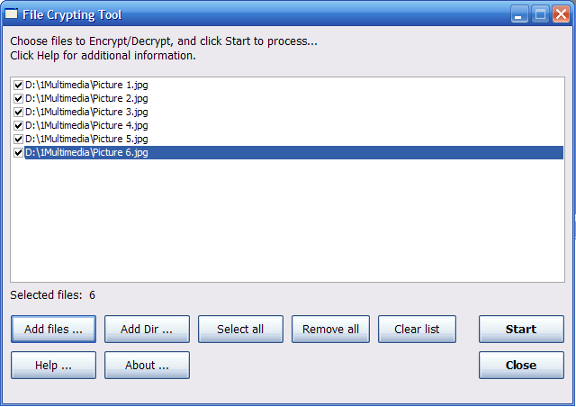



## File Crypting Tool

### Description

Crypting program created for encrypt/decrypt files.

It is very fast, and best for images (JPEG, BMP, GIF...), but you can use it for crypt-decrypt video or other files... No special encription metod was used, (just reversing some bynary data), so it is not good for textual files, use it only for binary files! - e. g. if you want to protect your images from viewing by other people :-)

To encrypt/decrypt files, you have to choose one or more files, or folder where files you want to process exists.

Only selected files (when check-box is selected) will be processed. When you choose some files or folders, all files in list-box are selected automaticaly. If you want to exclude a file from encrypt/decrypt process, uncheck it.

By clicking on Start button, process starts.

If a file is previously encrypted with this tool, it will be decrypted.

A file that is not previously encrypted with this tool, will be encrypted.
 
### More Info
 

             |
---                |---
**Submitted On**   |2004-02-09 01:57:38
**By**             |[deduka](https://github.com/Planet-Source-Code/PSCIndex/blob/master/ByAuthor/deduka.md)
**Level**          |Intermediate
**User Rating**    |5.0 (10 globes from 2 users)
**Compatibility**  |VB 5\.0, VB 6\.0
**Category**       |[Files/ File Controls/ Input/ Output](https://github.com/Planet-Source-Code/PSCIndex/blob/master/ByCategory/files-file-controls-input-output__1-3.md)
**World**          |[Visual Basic](https://github.com/Planet-Source-Code/PSCIndex/blob/master/ByWorld/visual-basic.md)
**Archive File**   |[File\_Crypt2107343252008\.zip](https://github.com/Planet-Source-Code/deduka-file-crypting-tool__1-70323/archive/master.zip)

